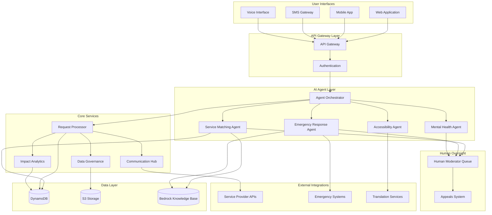

# Design Document: AI for Communities, Access & Public Impact

## Overview

The AI for Communities, Access & Public Impact platform is a cloud-native system built on AWS that leverages artificial intelligence to connect underserved communities with essential services and support. The platform employs a multi-agent AI architecture using Amazon Bedrock for intelligent service matching, request processing, and emergency coordination, while maintaining human oversight for all critical decisions affecting vulnerable populations.

The system prioritizes accessibility through WCAG 2.2 compliance, multi-channel communication support, and adaptive interfaces that accommodate users with diverse abilities and technical literacy levels. Built using AWS CDK for infrastructure as code, the platform ensures scalability, reliability, and rapid deployment suitable for hackathon development timelines.

Key architectural principles include:
- **Human-in-the-loop AI governance** for ethical decision-making
- **Multi-modal accessibility** supporting voice, text, and assistive technologies
- **Privacy-first data handling** with encryption and minimal data retention
- **Microservices architecture** enabling independent scaling and development
- **Event-driven communication** for real-time responsiveness

## Architecture

### High-Level Architecture



### AWS Infrastructure Architecture

The platform leverages AWS services for scalability, reliability, and managed AI capabilities:

**Compute Layer:**
- **AWS Lambda**: Serverless functions for request processing, AI agent coordination, and API endpoints
- **Amazon ECS Fargate**: Containerized services for long-running processes like real-time communication
- **AWS Step Functions**: Orchestration of complex workflows including emergency response protocols

**AI and ML Services:**
- **Amazon Bedrock**: Foundation models and multi-agent collaboration for intelligent service matching
- **Amazon Bedrock Knowledge Base**: RAG-enabled knowledge retrieval for service information and policies
- **Amazon Comprehend**: Natural language processing for request analysis and sentiment detection
- **Amazon Polly/Transcribe**: Text-to-speech and speech-to-text for voice accessibility

**Data and Storage:**
- **Amazon DynamoDB**: Primary database for user requests, service matches, and real-time data
- **Amazon S3**: Secure storage for documents, audit logs, and encrypted sensitive data
- **Amazon ElastiCache**: Caching layer for frequently accessed service information

**Communication and Integration:**
- **Amazon API Gateway**: RESTful API management with rate limiting and authentication
- **Amazon SNS/SQS**: Event-driven messaging for asynchronous processing and notifications
- **Amazon Pinpoint**: Multi-channel communication (SMS, email, push notifications)
- **Amazon Connect**: Voice interface and telephony integration

**Security and Governance:**
- **AWS IAM**: Fine-grained access control and service permissions
- **AWS KMS**: Encryption key management for data protection
- **AWS CloudTrail**: Audit logging for compliance and accountability
- **AWS WAF**: Web application firewall for API protection

## Components and Interfaces

### AI Agent Orchestrator

The central coordination component that manages multi-agent collaboration using Amazon Bedrock's agent orchestration capabilities.

**Responsibilities:**
- Route incoming requests to appropriate specialized agents
- Coordinate multi-agent workflows for complex scenarios
- Enforce human-in-the-loop policies for high-risk decisions
- Maintain conversation context across agent interactions

**Key Interfaces:**
```typescript
interface AgentOrchestrator {
  processRequest(request: CommunityRequest): Promise<AgentResponse>
  escalateToHuman(decision: AgentDecision, reason: EscalationReason): Promise<HumanReview>
  coordinateAgents(agents: Agent[], context: RequestContext): Promise<CollaborativeResponse>
}
```

### Service Matching Agent

Specialized Bedrock agent that analyzes community requests and matches them with available services using RAG-enhanced knowledge retrieval.

**Capabilities:**
- Natural language understanding of service requests
- Semantic matching between needs and available resources
- Priority scoring based on urgency and vulnerability factors
- Integration with service provider APIs for real-time availability

**Knowledge Base Integration:**
- Service provider catalogs and capabilities
- Eligibility criteria and application processes
- Geographic service coverage and accessibility features
- Historical matching success patterns

### Emergency Response Agent

Dedicated agent for crisis situations requiring immediate coordination and resource mobilization.

**Emergency Detection:**
- Keyword analysis for crisis indicators
- Sentiment analysis for distress signals
- Integration with emergency service APIs
- Automated escalation protocols

**Response Coordination:**
- Resource availability analysis
- Population vulnerability mapping
- Multi-language alert generation
- Real-time status tracking

### Accessibility Engine

Comprehensive accessibility management system ensuring WCAG 2.2 compliance and adaptive user experiences.

**Core Features:**
- **Adaptive UI Generation**: Dynamic interface modification based on user accessibility needs
- **Multi-Modal Input Processing**: Voice, text, gesture, and assistive device support
- **Content Transformation**: Automatic alt-text generation, audio descriptions, simplified language
- **Assistive Technology Integration**: Screen reader compatibility, keyboard navigation, voice control

**Implementation Approach:**
```typescript
interface AccessibilityEngine {
  adaptInterface(userProfile: AccessibilityProfile): Promise<AdaptedInterface>
  processMultiModalInput(input: MultiModalInput): Promise<StandardizedRequest>
  generateAlternativeFormats(content: Content): Promise<AccessibleContent>
  validateWCAGCompliance(component: UIComponent): Promise<ComplianceReport>
}
```

### Human Oversight System

Critical component ensuring ethical AI governance through structured human review processes.

**Review Triggers:**
- AI confidence scores below defined thresholds
- High-risk decision categories (mental health, emergency, vulnerable populations)
- User-initiated appeals and disputes
- Bias detection alerts

**Workflow Management:**
- Priority queue for urgent reviews
- Specialist routing based on expertise areas
- Decision audit trails and accountability
- Feedback loops for AI model improvement

### Communication Hub

Multi-channel communication orchestrator supporting diverse user preferences and accessibility needs.

**Supported Channels:**
- Web-based chat with accessibility features
- SMS with simplified language options
- Voice calls with real-time transcription
- Email with structured formatting
- Mobile push notifications
- Integration with assistive technologies

**Adaptive Communication:**
- User preference learning and adaptation
- Language translation and localization
- Reading level adjustment
- Cultural sensitivity considerations

## Data Models

### Core Entity Models

**CommunityRequest**
```typescript
interface CommunityRequest {
  id: string
  userId: string
  requestType: RequestType
  description: string
  urgencyLevel: UrgencyLevel
  accessibilityNeeds: AccessibilityProfile
  preferredCommunication: CommunicationPreference[]
  location: GeographicLocation
  sensitiveData: EncryptedData
  timestamp: Date
  status: RequestStatus
  assignedAgents: string[]
  humanReviewRequired: boolean
}
```

**ServiceMatch**
```typescript
interface ServiceMatch {
  id: string
  requestId: string
  serviceProviderId: string
  matchScore: number
  matchReasoning: string
  eligibilityStatus: EligibilityStatus
  estimatedWaitTime: Duration
  accessibilitySupport: AccessibilityFeature[]
  requiredDocuments: Document[]
  contactInformation: ContactInfo
  humanApproved: boolean
  approvalTimestamp?: Date
}
```

**UserProfile**
```typescript
interface UserProfile {
  id: string
  accessibilityProfile: AccessibilityProfile
  communicationPreferences: CommunicationPreference[]
  languagePreferences: string[]
  consentSettings: ConsentSettings
  emergencyContacts: EmergencyContact[]
  serviceHistory: ServiceInteraction[]
  privacySettings: PrivacySettings
  lastActive: Date
}
```

**AccessibilityProfile**
```typescript
interface AccessibilityProfile {
  visualNeeds: VisualAccessibilityNeeds
  auditoryNeeds: AuditoryAccessibilityNeeds
  motorNeeds: MotorAccessibilityNeeds
  cognitiveNeeds: CognitiveAccessibilityNeeds
  assistiveTechnologies: AssistiveTechnology[]
  preferredInteractionMethods: InteractionMethod[]
  customizations: UICustomization[]
}
```

### Data Governance Models

**DataGovernanceRecord**
```typescript
interface DataGovernanceRecord {
  dataId: string
  dataType: DataType
  encryptionStatus: EncryptionStatus
  retentionPolicy: RetentionPolicy
  accessLog: AccessLogEntry[]
  consentStatus: ConsentStatus
  anonymizationLevel: AnonymizationLevel
  complianceFlags: ComplianceFlag[]
  auditTrail: AuditEntry[]
}
```

**ConsentSettings**
```typescript
interface ConsentSettings {
  dataCollection: ConsentLevel
  dataSharing: ConsentLevel
  analyticsParticipation: ConsentLevel
  communicationPreferences: ConsentLevel
  researchParticipation: ConsentLevel
  consentTimestamp: Date
  consentVersion: string
  withdrawalOptions: WithdrawalOption[]
}
```

### Impact Measurement Models

**ImpactMetrics**
```typescript
interface ImpactMetrics {
  id: string
  timeframe: TimeRange
  totalRequests: number
  successfulMatches: number
  averageResponseTime: Duration
  userSatisfactionScore: number
  accessibilityUsageStats: AccessibilityStats
  demographicBreakdown: DemographicStats
  serviceProviderMetrics: ProviderMetrics[]
  emergencyResponseMetrics: EmergencyStats
  privacyCompliantData: boolean
}
```

### Security and Audit Models

**AuditEntry**
```typescript
interface AuditEntry {
  id: string
  timestamp: Date
  userId?: string
  action: AuditAction
  resourceId: string
  resourceType: ResourceType
  outcome: ActionOutcome
  ipAddress: string
  userAgent: string
  riskScore: number
  complianceFlags: ComplianceFlag[]
}
```

**EncryptedData**
```typescript
interface EncryptedData {
  encryptedContent: string
  encryptionMethod: EncryptionMethod
  keyId: string
  encryptionTimestamp: Date
  accessControlList: AccessControl[]
  retentionExpiry: Date
}
```

## Correctness Properties

*A property is a characteristic or behavior that should hold true across all valid executions of a system—essentially, a formal statement about what the system should do. Properties serve as the bridge between human-readable specifications and machine-verifiable correctness guarantees.*

### Property 1: Multi-Channel Request Processing
*For any* community service request submitted through any supported channel (web, voice, SMS), the Community_Platform should successfully process the request and route it to appropriate service providers within the specified time limits.
**Validates: Requirements 1.1, 1.3**

### Property 2: Comprehensive Accessibility Compliance
*For any* user interaction with accessibility needs, the Accessibility_Engine should provide appropriate accommodations (screen reader compatibility, voice navigation, simplified interfaces, alternative content formats) while maintaining equivalent functionality and performance to standard interfaces.
**Validates: Requirements 1.2, 4.1, 4.2, 4.3, 4.4, 4.5**

### Property 3: Data Encryption and Privacy Protection
*For any* personal or sensitive data handled by the system, the Data_Governance_System should encrypt the data both in transit and at rest using industry-standard methods, and only share the minimum necessary information for service delivery.
**Validates: Requirements 1.4, 6.1, 6.4**

### Property 4: Multi-Language Support
*For any* request submitted in a supported community language, the Community_Platform should provide appropriate translation services and culturally appropriate responses.
**Validates: Requirements 1.5, 5.3**

### Property 5: AI Service Matching with Human Oversight
*For any* service request processed by AI agents, the system should analyze and rank available services based on urgency, proximity, accessibility needs, and service capacity, but require human moderator approval before finalizing matches for high-risk situations.
**Validates: Requirements 2.1, 2.2, 2.3, 2.4, 10.1**

### Property 6: Queue Management for Unavailable Services
*For any* service request where no suitable services are immediately available, the Community_Platform should add the request to a priority queue and notify relevant service providers.
**Validates: Requirements 2.5**

### Property 7: Emergency Response Coordination
*For any* emergency situation detected or reported, the Community_Platform should immediately escalate to emergency protocols, analyze resource deployment factors, generate accessible multi-language alerts, provide real-time status updates, and generate effectiveness reports upon conclusion.
**Validates: Requirements 3.1, 3.2, 3.3, 3.4, 3.5**

### Property 8: Mental Health Crisis Intervention
*For any* mental health service access or detected crisis situation, the Community_Platform should provide confidential screening tools, immediately connect high-risk users with qualified human counselors, offer culturally appropriate resources, and provide follow-up care recommendations.
**Validates: Requirements 5.1, 5.2, 5.3, 5.5**

### Property 9: Privacy-Preserving Data Management
*For any* user data collection, storage, or deletion request, the Data_Governance_System should provide clear consent forms, securely store anonymized interaction logs, and complete data deletion within 30 days while preserving anonymized analytics.
**Validates: Requirements 5.4, 6.2, 6.3**

### Property 10: Comprehensive Impact Tracking
*For any* service delivery interaction, the Impact_Tracker should continuously monitor metrics (response times, successful matches, user satisfaction), generate privacy-preserving demographic reports, track long-term community outcomes, and collect anonymized success stories.
**Validates: Requirements 7.1, 7.2, 7.3, 7.4, 7.5**

### Property 11: Infrastructure Scalability and Reliability
*For any* system load condition or infrastructure failure, the Community_Platform should automatically scale resources, maintain response times under 5 seconds for critical functions, failover to backup systems with minimal disruption, maintain 99.5% uptime, and use blue-green deployment strategies.
**Validates: Requirements 8.1, 8.2, 8.3, 8.4, 8.5**

### Property 12: Multi-Channel Communication Optimization
*For any* communication sent to users, the Community_Platform should support all specified channels (SMS, email, voice, web chat, mobile notifications), respect user preferences for non-emergency communications, optimize format and timing per channel, maintain message consistency while adapting content, and attempt secondary channels when primary channels are unavailable.
**Validates: Requirements 9.1, 9.2, 9.3, 9.4, 9.5**

### Property 13: AI Governance and Accountability
*For any* AI decision or recommendation, the Community_Platform should escalate low-confidence decisions to human review, provide clear appeals processes with human arbitration, maintain comprehensive audit logs of all decisions and overrides, and immediately flag biased or erroneous decisions for review and system retraining.
**Validates: Requirements 10.2, 10.3, 10.4, 10.5**

## Error Handling

### Error Classification and Response Strategy

The platform implements a multi-tiered error handling approach that prioritizes user safety and service continuity:

**Critical Errors (System-Level Failures):**
- Infrastructure failures trigger automatic failover to backup systems
- Data corruption events initiate immediate data recovery protocols
- Security breaches activate incident response procedures with user notification
- AI system failures escalate all decisions to human moderators

**Service Errors (Application-Level Issues):**
- AI agent failures gracefully degrade to human-only processing
- Service provider API failures trigger alternative provider recommendations
- Translation service failures default to primary language with human translator escalation
- Authentication failures provide clear recovery paths with accessibility support

**User Errors (Input and Interaction Issues):**
- Invalid request formats trigger guided correction with accessibility accommodations
- Missing required information prompts progressive disclosure with assistance options
- Communication channel failures automatically attempt alternative preferred channels
- Accessibility feature failures provide immediate alternative interaction methods

### Error Recovery Mechanisms

**Graceful Degradation:**
- AI services degrade to rule-based matching when ML models fail
- Real-time features fall back to batch processing during high load
- Advanced accessibility features degrade to basic WCAG compliance
- Multi-language support falls back to primary language with human assistance

**User-Centric Error Communication:**
- All error messages follow plain language principles
- Error notifications respect user communication preferences
- Visual errors include audio alternatives and vice versa
- Error recovery guidance adapts to user accessibility needs

**Audit and Learning:**
- All errors are logged with privacy-preserving identifiers
- Error patterns inform system improvements and training updates
- User feedback on error experiences drives UX enhancements
- Error recovery success rates contribute to impact metrics

## Testing Strategy

### Dual Testing Approach

The platform employs both unit testing and property-based testing to ensure comprehensive coverage and correctness validation:

**Unit Testing Focus:**
- Specific examples of successful service matching scenarios
- Edge cases for accessibility feature activation
- Error condition handling for each communication channel
- Integration points between AI agents and human oversight systems
- Specific emergency response scenarios and protocols

**Property-Based Testing Focus:**
- Universal properties that hold across all user inputs and system states
- Comprehensive input coverage through randomized test generation
- Validation of correctness properties defined in the design document
- Minimum 100 iterations per property test to ensure statistical confidence

### Property-Based Testing Configuration

**Testing Framework:** AWS Lambda-based test execution using Hypothesis (Python) or fast-check (TypeScript)

**Test Configuration:**
- Minimum 100 iterations per property test
- Randomized input generation for user requests, accessibility profiles, and system states
- Each property test references its corresponding design document property
- Tag format: **Feature: ai-communities-impact, Property {number}: {property_text}**

**Key Property Test Categories:**

1. **Accessibility Compliance Tests:**
   - Generate random accessibility profiles and verify appropriate accommodations
   - Test WCAG 2.2 compliance across all generated UI variations
   - Validate performance parity between accessible and standard interfaces

2. **AI Decision Validation Tests:**
   - Generate random service requests and verify matching algorithm correctness
   - Test human oversight triggers across various confidence score scenarios
   - Validate bias detection and mitigation across diverse user demographics

3. **Data Privacy and Security Tests:**
   - Generate random data scenarios and verify encryption and privacy compliance
   - Test data deletion and anonymization across various data types
   - Validate consent management and user control mechanisms

4. **Multi-Channel Communication Tests:**
   - Generate random communication scenarios across all supported channels
   - Test message adaptation and optimization for different channel constraints
   - Validate fallback communication mechanisms and preference adherence

5. **Emergency Response Tests:**
   - Generate random emergency scenarios and verify response protocol activation
   - Test resource allocation algorithms across various crisis conditions
   - Validate multi-language alert generation and accessibility compliance

### Integration Testing Strategy

**Human-in-the-Loop Testing:**
- Simulated human moderator responses for approval workflow validation
- Appeals process testing with various dispute scenarios
- Bias detection and correction workflow validation

**External Service Integration:**
- Mock service provider APIs for testing service matching and availability
- Emergency service integration testing with simulated crisis scenarios
- Translation service integration with various language combinations

**Performance and Scalability Testing:**
- Load testing with simulated community request volumes
- Failover testing with infrastructure component failures
- Auto-scaling validation under various load patterns

### Continuous Testing and Monitoring

**Production Property Monitoring:**
- Continuous validation of key properties in production environment
- Real-time alerting when properties are violated
- Automated rollback triggers for property violations

**User Experience Testing:**
- Accessibility testing with real assistive technology users
- Usability testing with community members from target demographics
- Cultural sensitivity validation with diverse community representatives

**Compliance and Audit Testing:**
- Regular WCAG 2.2 compliance audits
- Data privacy regulation compliance verification
- Security penetration testing and vulnerability assessments
